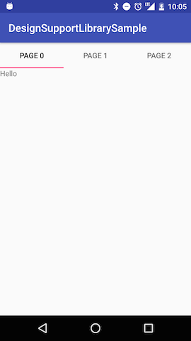
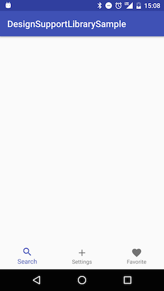

# Design Support Library 課題

http://yaraki.github.io/slides/droidgirls-201611/#1

```
    compile 'com.android.support:design:25.0.1'
```

## TextInputLayout

* https://developer.android.com/reference/android/support/design/widget/TextInputLayout.html

* エラー機能を使ってみよう
* 文字カウント機能を使ってみよう
* パスワードの表示非表示切り替え機能を使ってみよう


## Floating Action Button 

* https://developer.android.com/reference/android/support/design/widget/FloatingActionButton.html

* 右下にFABを表示してみよう
* FABをタップしたらToastを出してみよう
* fabSize を変えてみよう


## Snackbar

* https://developer.android.com/reference/android/support/design/widget/Snackbar.html

* ボタンがタップされたらSnackbarを表示してみよう
* SnackbarにActionを追加してみよう


## AppBarLayout

* https://developer.android.com/reference/android/support/design/widget/AppBarLayout.html


* AppBarLayout + Toolbar を表示してみよう


* NoActionBarなテーマが必要なので注意

```
    <style name="AppTheme.NoActionBar" parent="Theme.AppCompat.Light.NoActionBar">
        <!-- Customize your theme here. -->
        <item name="colorPrimary">@color/colorPrimary</item>
        <item name="colorPrimaryDark">@color/colorPrimaryDark</item>
        <item name="colorAccent">@color/colorAccent</item>
    </style>
```

* AppBarLayoutにダークテーマを指定するには

```
android:theme="@style/ThemeOverlay.AppCompat.Dark.ActionBar"
```


## CoordinatorLayout

* https://developer.android.com/reference/android/support/design/widget/CoordinatorLayout.html

* AppBarLayout を CoordinatorLayout の中にいれてスクロール時に消えるようにしてみよう


* RecyclerView と組み合わせてみよう


## CollapsingToolbarLayout

* https://developer.android.com/reference/android/support/design/widget/CollapsingToolbarLayout.html

* CoordinatorLayout + AppBarLayout + CoordinatorLayout + ImageView + Toolbar で ActionBar が縮む動きを作ってみよう
* app:contentScrim で縮んだときの色を指定してみよう


## BottomSheet

* https://developer.android.com/reference/android/support/design/widget/BottomSheetDialog.html

* ボタンをタップしたらBottomSheetDialogが表示されるようにしてみよう


* Presistent なBottomSheetを作ってみよう


## TabLayout

* https://developer.android.com/reference/android/support/design/widget/TabLayout.html

* 固定タブを表示してみよう


* スクロールできるタブを表示してみよう


* ViewPagerと組み合わせてみよう




## BottomNavigationView

* https://developer.android.com/reference/android/support/design/widget/BottomNavigationView.html

* BottomNavigationViewを配置してみよう




## NavigationView

* https://developer.android.com/reference/android/support/design/widget/NavigationView.html
* https://developer.android.com/reference/android/support/v4/widget/DrawerLayout.html
* https://developer.android.com/training/implementing-navigation/nav-drawer.html

* NavigationViewを配置してみよう


