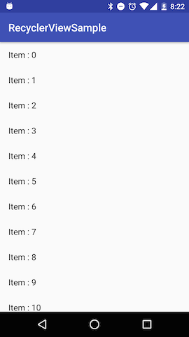
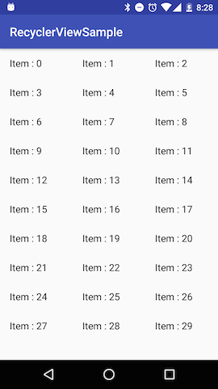
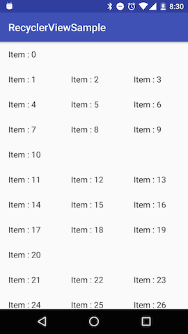
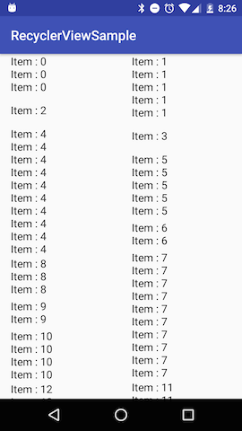
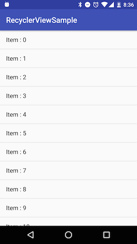
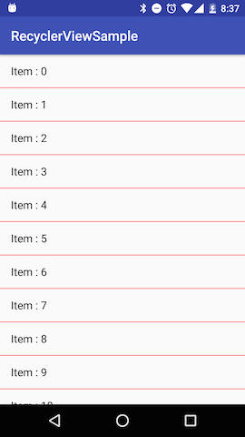
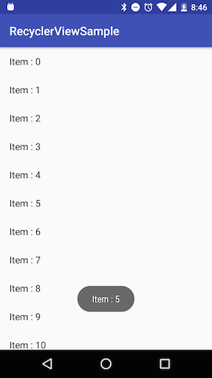
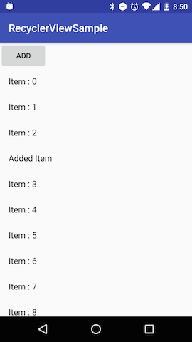
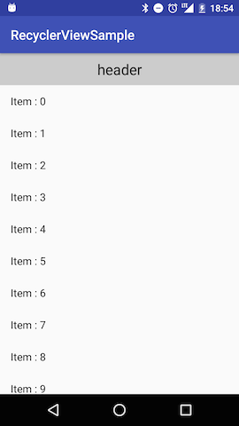
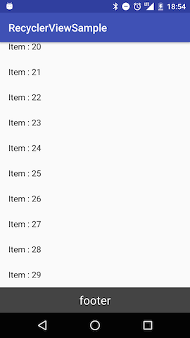

# RecyclerView 課題

http://www.slideshare.net/yanzm/droidgirls-recyclerview

```
    compile 'com.android.support:recyclerview-v7:25.1.0'
```


## LinearLayoutManager

* https://developer.android.com/reference/android/support/v7/widget/LinearLayoutManager.html

* ListView みたいなリストを作ってみよう
* orientation を horizontal にしてみよう
* reverseLayout にしてみよう
* stackFromEnd にしてみよう




## GridLayoutManager 

* https://developer.android.com/reference/android/support/v7/widget/GridLayoutManager.html

* 3列のグリッドを作ってみよう



* 10で割り切れる位置のアイテムは横いっぱいに広がるようにしてみよう
* ヒント : https://developer.android.com/reference/android/support/v7/widget/GridLayoutManager.html#setSpanSizeLookup(android.support.v7.widget.GridLayoutManager.SpanSizeLookup)




## StaggeredGridLayoutManager

* https://developer.android.com/reference/android/support/v7/widget/StaggeredGridLayoutManager.html

* StaggeredGridLayoutManager を使ってみよう




## DividerItemDecoration

* https://developer.android.com/reference/android/support/v7/widget/DividerItemDecoration.html

* DividerItemDecoration を使って区切り線を表示してみよう



* [中級者向け] DividerItemDecoration の色を変えてみよう
** ヒント : https://developer.android.com/reference/android/support/v7/widget/DividerItemDecoration.html#setDrawable(android.graphics.drawable.Drawable)




## Item Click

* https://developer.android.com/reference/android/support/design/widget/CoordinatorLayout.html

* リストのアイテムをタップしたときに Toast を表示してみよう




## notify**

* https://developer.android.com/reference/android/support/v7/widget/RecyclerView.Adapter.html#notifyItemChanged(int)
* https://developer.android.com/reference/android/support/v7/widget/RecyclerView.Adapter.html#notifyItemInserted(int)
* https://developer.android.com/reference/android/support/v7/widget/RecyclerView.Adapter.html#notifyItemMoved(int, int)
* https://developer.android.com/reference/android/support/v7/widget/RecyclerView.Adapter.html#notifyItemRemoved(int)

* https://developer.android.com/reference/android/support/v7/widget/RecyclerView.Adapter.html#notifyItemRangeChanged(int, int)
* https://developer.android.com/reference/android/support/v7/widget/RecyclerView.Adapter.html#notifyItemRangeInserted(int, int)
* https://developer.android.com/reference/android/support/v7/widget/RecyclerView.Adapter.html#notifyItemRangeRemoved(int, int)

* ボタンをタップしたらランダムな位置にアイテムが追加されるようにしてみよう




## Header & Footer

* getItemViewType() を Override して Header と Footer をつけてみよう





