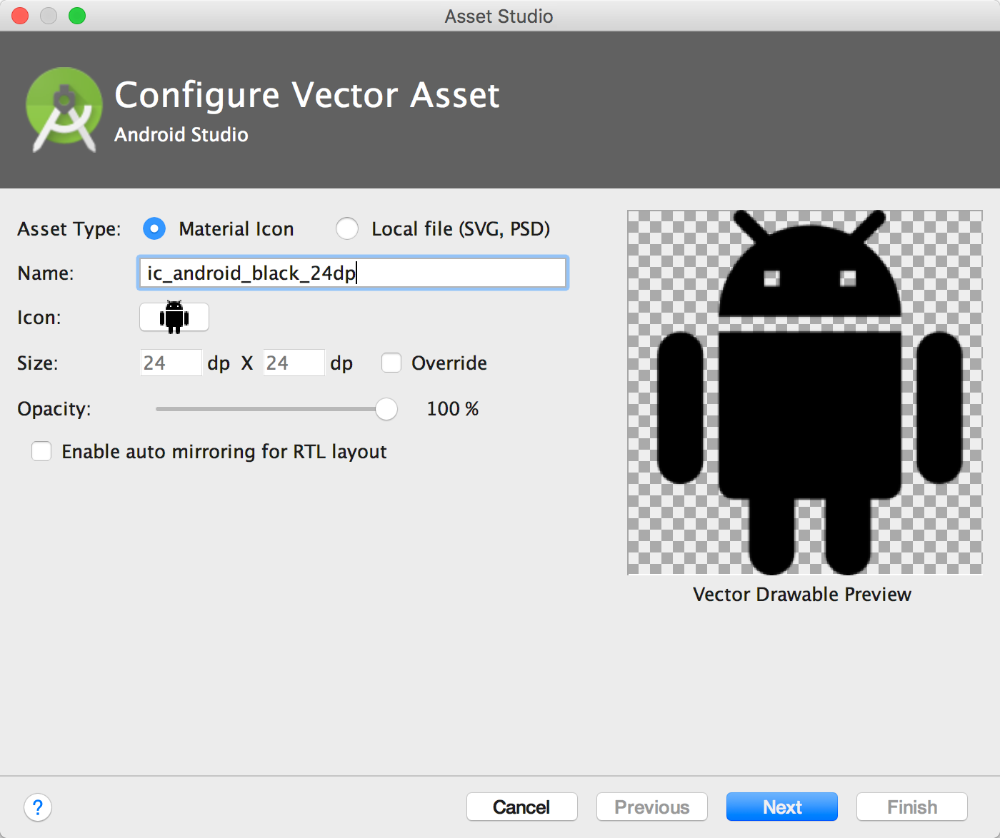
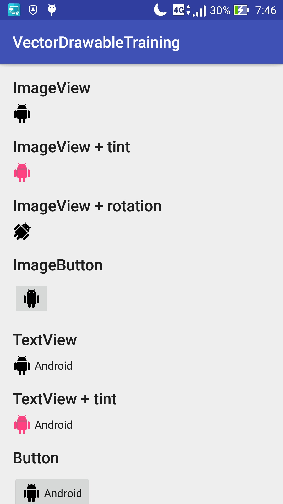
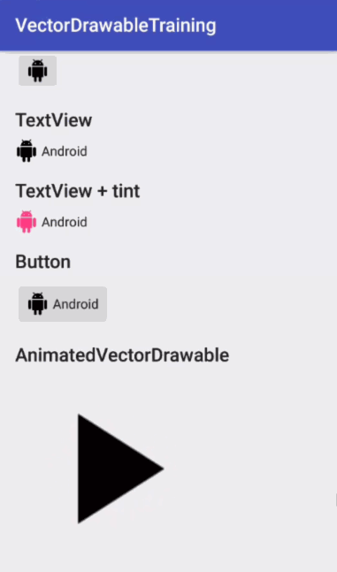
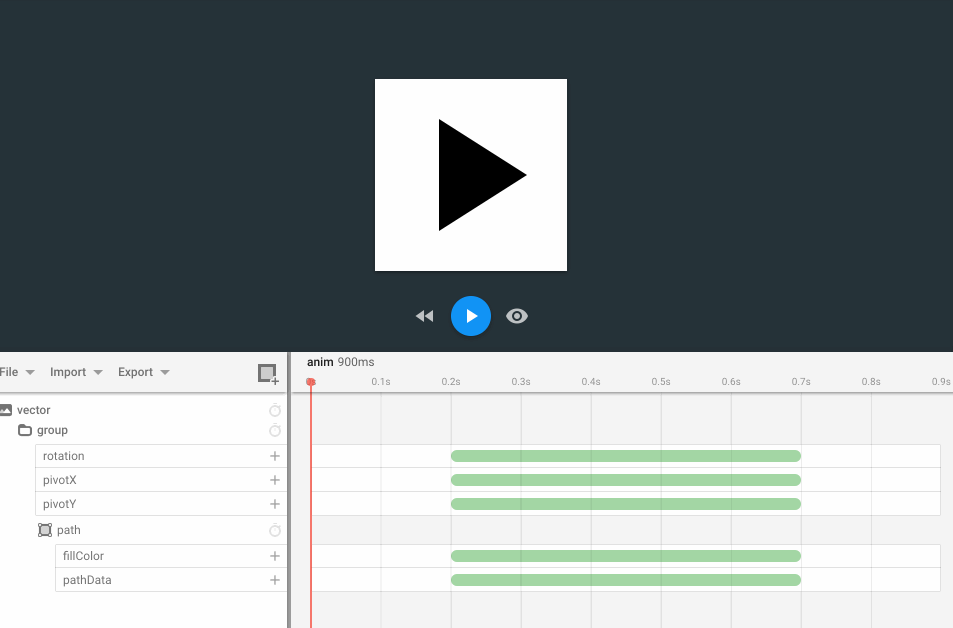

# VectorDrawable 課題

https://speakerdeck.com/konifar/vectordrawable-and-animatedvectordrawable

```
    compile "com.android.support:support-vector-drawable:25.1.0"
    compile "com.android.support:animated-vector-drawable:25.1.0"
```


## Vector Asset Studio

* https://developer.android.com/studio/write/vector-asset-studio.html

* material icon をインポートしてみよう
* local svg file をインポートしてみよう（cat.svgを用意してあります）




## VectorDrawable

* https://developer.android.com/reference/android/graphics/drawable/VectorDrawable.html

* ImageViewに表示してみよう
* TextViewの左側に表示してみよう
* 色を変えてみよう
* 45度回転させてみよう
  * ヒント : `<group>` タグ
* TextViewにセットしたVectorDrawableにtintをあててみよう
  * ヒント : `DrawableCompat.setTint()` https://developer.android.com/reference/android/support/v4/graphics/drawable/DrawableCompat.html




## AnimatedVectorDrawable

* https://developer.android.com/reference/android/graphics/drawable/AnimatedVectorDrawable.html

* ImageViewのアイコンを回転させてみよう
* ImageViewのアイコンの色を変えてみよう
* アニメーションのInterpolatorを変更してみよう
* アニメーションのdurationを変更してみよう




## AndroidIconAnimator

* https://romannurik.github.io/AndroidIconAnimator/

* 回転するアニメーションを作ってみよう
* パスが変形するアニメーションを作ってみよう


