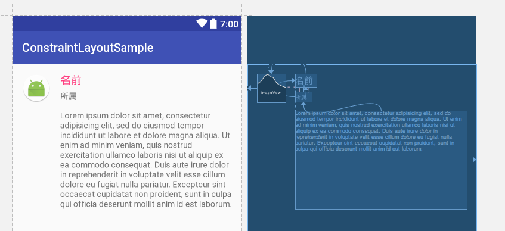
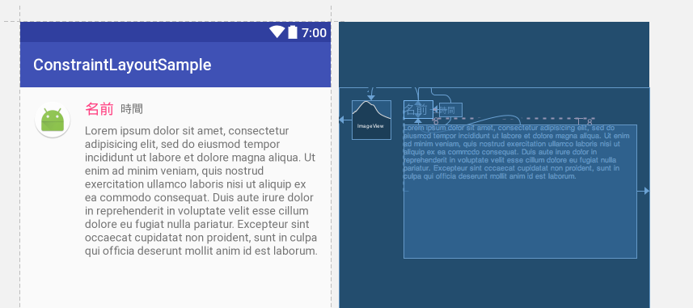
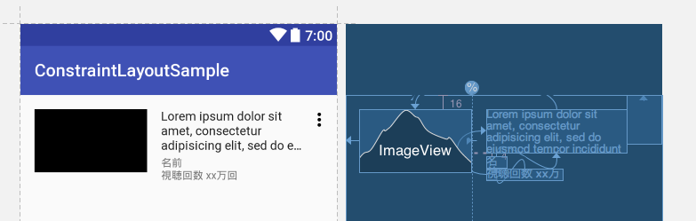
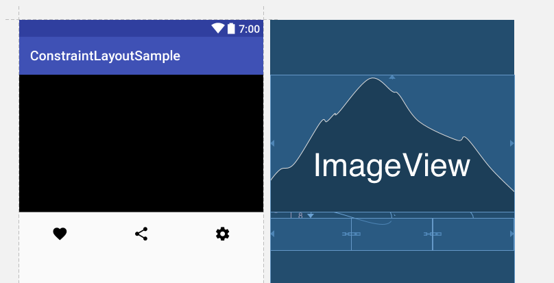
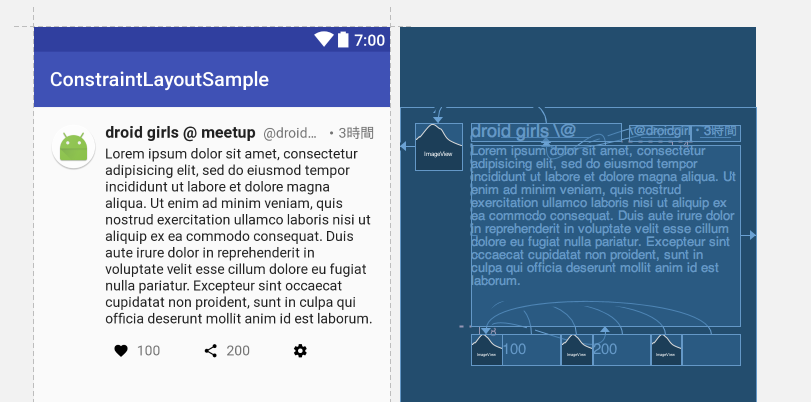

# 資料

https://speakerdeck.com/yanzm/constraintlayout

# 課題

## 課題1

次のレイアウトを作ろう

レイアウトファイル名 : sample_layout1.xml

## 課題2

次のレイアウトを作ろう

レイアウトファイル名 : sample_layout2.xml

## 課題3

次のレイアウトを作ろう

レイアウトファイル名 : sample_layout3.xml

### ヒント

* Guideline 40%
* ImageView は 16:9
* [File] - [New] - [Vector Asset] : more vert
* android:background="?android:selectableItemBackground"

## 課題4

次のレイアウトを作ろう

レイアウトファイル名 : sample_layout4.xml

### ヒント

* chain
* ImageView は 16:9
* [File] - [New] - [Vector Asset] : favorite, share, settings
* android:background="?android:selectableItemBackground"

## 課題5

次のレイアウトを作ろう

レイアウトファイル名 : sample_layout5.xml

* chain

