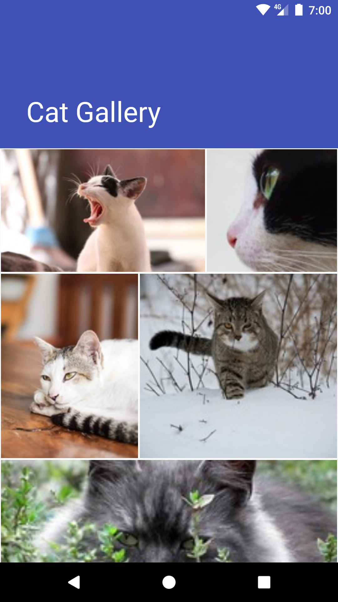

# 資料

https://goo.gl/wWtpST

# 課題
`kadai` ディレクトリを Android Studio で開いてください。
課題1から3はウォーミングアップとして、FlexboxLayout に慣れるための易しめの問題にしています。初めて触れる人は課題1から、既に知っている人、慣れている人は課題4からやってみましょう。

--- 
## 課題1 ウォーミングアップ1
モジュール `warming-up`, レイアウト `warmingup1.xml`

FlexboxLayout を使って下のようなレイアウトに変更して、portrait, land 両方で期待通りか確認してみましょう。

--- 

## 課題2 ウォーミングアップ2
モジュール `warming-up`, レイアウト `warmingup2.xml` (実行する時は`MainActivity`の `setContentView`の引数を `warmingup2` に変更してください)

FlexboxLayout を使って下のようなレイアウトに変更してみましょう

--- 

## 課題3 ウォーミングアップ3
モジュール `warming-up`, レイアウト `warmingup3.xml` (実行する時は`MainActivity`の `setContentView`の引数を `warmingup3` に変更してください)

FlexboxLayout を使って下のようなレイアウトに変更してみましょう

--- 

## 課題4 LinearLayout を FlexboxLayout を使って書き換えてみよう
モジュール `kadai4-app` を Android Studio から実行して、`1`のTextViewをクリックします。現れたダイアログは現在 LinearLayout を使って書かれています(
kadai/app/src/main/res/layout/fragment_flex_item_edit.xml)。それを FlexboxLayout を使用して見た目が良いように書き換えてみましょう。その時下記の点を守って配置してみましょう。
縦向きの画面で確認できたら、画面を横向きにしても条件を守れているかも確認しましょう。
- `Wrap Before`の CheckBox はダイアログの一番左に配置されること
- `Flex Basis Percent`と`Width`は同じ行には配置されないこと
- 入力欄の左端と右端は全ての行で揃うように

---
ヒント: fragment_flex_item_edit.xml のレイアウトファイルを修正するだけで実現できます

flexbox-layout の GitHub レポジトリに FlexboxLayout を使用したバージョンのファイルがありますが、練習のために見ないでやってみましょう。

FlexboxLayout使用前

***

FlexboxLayout 使用後 Portrait

***

FlexboxLayout 使用後 Land

--- 

## 課題5 FlexboxLayoutManager を使ってみよう (早く終わった人いれば)
`kadai5-app` モジュールを実行してみましょう。RecyclerView と LinearLayoutManager を使って猫画像が見れます。

LinearLayoutManager 使用時

これを FlexboxLayoutManager を使用して下記のような見た目にしてみましょう。

ヒント : 今回は Kotlin コードの変更だけで実現できます。

FlexboxLayoutManager 使用時 Portrait

FlexboxLayoutManager 使用時 Land

